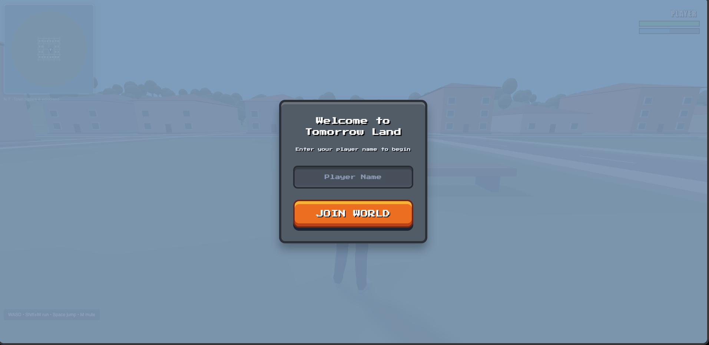
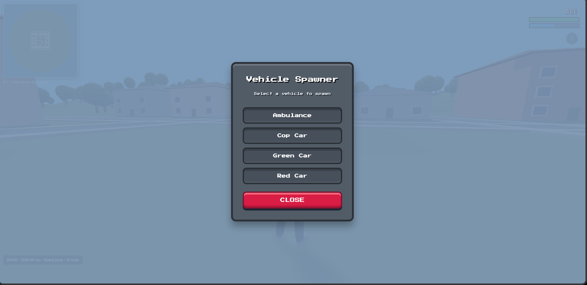
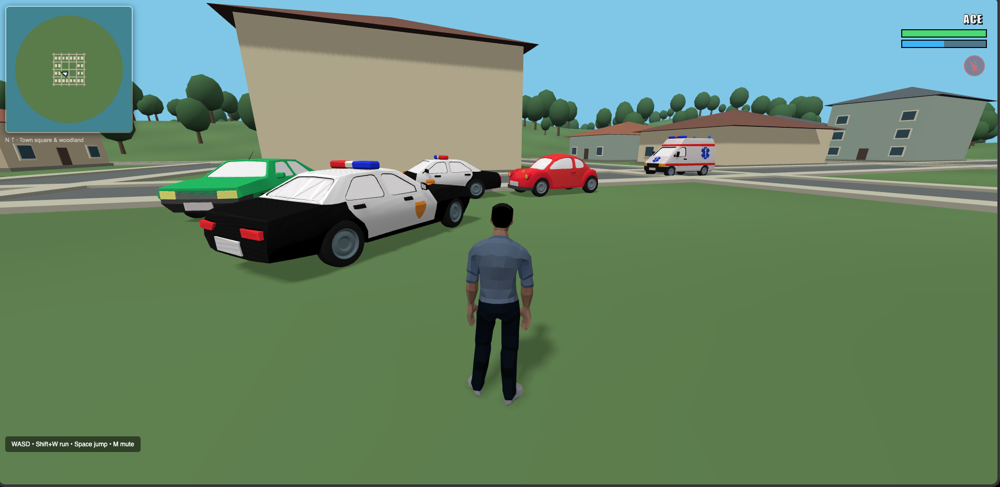

# Tomorrow Land

A 3D procedural multiplayer world.

**Play the game here:** [https://multiplayer-chi.vercel.app/](https://multiplayer-chi.vercel.app/)

## Features

- **Multiplayer:** See and interact with other players in real-time.
- **Proximity Voice Chat:** Talk to players near you. The audio uses a linear falloff based on your distance to other players.
- **Voice Controls:** Mute and unmute your microphone at any time by pressing **M** or clicking the mic icon on the HUD.
- **Procedural World:** Explore a shared island featuring a town square, woodland, hills, and a coastline.
- **Collision & Physics:** Fully physical world where you can jump on objects, climb hills, and collide with trees and buildings.
- **Minimap:** A real-time minimap to help you navigate the world.
- **Animations:** Fully animated character models with walking, running, and jumping states.
- **Dynamic Camera:** Mouse-controlled GTA-style camera with pitch control.
- **Vehicles:** Press **V** to open a vehicle spawner and choose from various drivable cars. Press **E** to enter and drive them around the island.

## Vehicle Spawner & Multiplayer Integration

Players can open the vehicle spawner menu to choose from a variety of vehicles. The chosen vehicle is synchronized across the multiplayer network, allowing all players to see and interact with it.

## Architecture

- **Game State Synchronization:** Player positions, rotations, and animations are synchronized using an **MQTT** broker (`test.mosquitto.org`). The game state is broadcasted efficiently to all connected clients.
- **Voice Chat (WebRTC):** Proximity voice chat is established via **WebRTC** for direct **Peer-to-Peer (P2P)** connections. The MQTT broker is used solely as a signaling server to exchange session descriptions and ICE candidates, ensuring minimal latency for voice communication once the P2P connection is established.

## Security

- **End-to-End Encryption:** Voice chat is handled through WebRTC, which mandates encryption (DTLS/SRTP) for all peer-to-peer data and media streams, ensuring secure, private communications.
- **Input Sanitization:** Player names and metadata are strictly sanitized on the client side before being broadcasted via MQTT to prevent XSS (Cross-Site Scripting) or injection attacks.
- **Secure Dependencies:** External assets and libraries are loaded securely over HTTPS using strict resource integrity checks where applicable.

## Safety

- **Privacy First:** All processing and game rendering happens locally on your device. Nothing leaves your browser except the minimal game state required for multiplayer synchronization.
- **No Data Collection:** We do not collect, store, or track any personal information or telemetry.

## Controls

- **W, A, S, D** or **Arrow Keys**: Move around / Drive
- **Mouse Move**: Look around / Rotate camera
- **Shift + W**: Run
- **Space**: Jump
- **V**: Open / Close Vehicle Spawner
- **E**: Enter / Exit Vehicle
- **M**: Mute / Unmute Voice Chat
